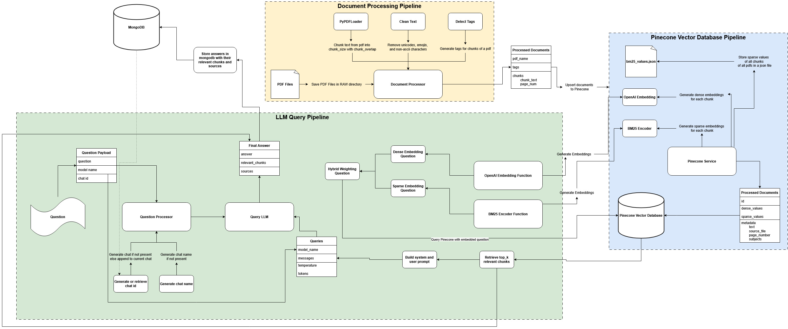

# NotStuck: AI-Powered Document Assistant

[](https://opensource.org/licenses/MIT) [](https://www.python.org/) [](https://fastapi.tiangolo.com/) [](https://nextjs.org/) [](https://www.pinecone.io/) [](https://openrouter.ai/)

---

## Overview

**NotStuck** is a production-ready, AI-powered RAG (Retrieval-Augmented Generation) system that helps you extract insights from your documents using cutting-edge AI models. Upload PDFs, ask questions, and receive intelligent answers powered by **hybrid search** and your choice of 10+ LLM models through OpenRouter.

> **Multi-Model Hybrid RAG System:**
> NotStuck combines **advanced hybrid search** (dense semantic + sparse BM25 embeddings), **intelligent context optimization** (deduplication, adaptive filtering), and **multi-model LLM support** (GPT-4, Claude, Gemini, Llama, and more) to deliver highly accurate, context-aware answers from your documents.

---

## Key Features

### 🚀 **Multi-Model LLM Support**
- Choose from **10+ AI models** via OpenRouter: GPT-4o, Claude 3.5, Gemini Pro, Llama 3.1, Mistral, and more
- Dynamic model selection in the UI
- Model-specific optimizations for different use cases

### 🔍 **Advanced Hybrid Search**
- **Dense embeddings** (OpenAI text-embedding-3-large) for semantic understanding
- **Sparse embeddings** (BM25) for keyword matching
- **Adaptive filtering** using statistical thresholds (mean ± std dev)
- **Cosine similarity metric** for better accuracy
- **TOP_K=30** for improved recall

### 📄 **Smart Document Processing**
- **Semantic-aware chunking** with configurable overlap (1000 chars, 200 overlap)
- **Automatic text cleaning** and normalization
- **LLM-based subject detection** for intelligent tagging
- **Temporary file processing** - no local storage required
- **Batch processing** with concurrent execution

### 🧠 **Intelligent Context Building**
- **Jaccard similarity deduplication** (85% threshold)
- **Token-aware truncation** (8000 max context tokens)
- **Preserves highest relevance chunks**
- **Smart prompt engineering** with structured context/question format

### ⚡ **Production-Ready Features**
- **Full Pydantic validation** for all API endpoints
- **Comprehensive error handling** with graceful degradation
- **Detailed logging** at all stages (requests, processing, errors)
- **Auto database reset** on startup for testing
- **Type-safe** throughout the entire pipeline

### 💎 **Developer Experience**
- **Interactive API docs** at `/docs`
- **Clean, modular architecture**
- **uv** for fast dependency management
- **Concurrently** runs backend first, then frontend
- **Hot reload** for rapid development

---

## Tech Stack

### **Backend**
- **[FastAPI](https://fastapi.tiangolo.com/)** - High-performance async API framework
- **[Pydantic](https://pydantic.dev/)** - Data validation and settings management
- **[Pinecone](https://www.pinecone.io/)** - Vector database with cosine similarity
- **[OpenRouter](https://openrouter.ai/)** - Unified API for 10+ LLM providers
- **[OpenAI Embeddings](https://platform.openai.com/docs/guides/embeddings)** - text-embedding-3-large (3072 dimensions)
- **[LangChain](https://github.com/langchain-ai/langchain)** - Document processing and chunking
- **[BM25](https://en.wikipedia.org/wiki/Okapi_BM25)** - Sparse embeddings for keyword search
- **[PyPDF](https://pypdf.readthedocs.io/)** - PDF text extraction
- **[NumPy](https://numpy.org/)** & **[scikit-learn](https://scikit-learn.org/)** - Statistical analysis
- **[uv](https://github.com/astral-sh/uv)** - Ultra-fast Python package manager

### **Frontend**
- **[Next.js 15](https://nextjs.org/)** - React framework with Turbopack
- **[TypeScript](https://www.typescriptlang.org/)** - Type-safe JavaScript
- **[Tailwind CSS](https://tailwindcss.com/)** - Utility-first CSS framework
- **[Shadcn/ui](https://ui.shadcn.com/)** - Re-usable component library
- **[Axios](https://axios-http.com/)** - HTTP client for API calls

### **Development Tools**
- **[Concurrently](https://www.npmjs.com/package/concurrently)** - Run multiple dev servers
- **[Pytest](https://pytest.org/)** - Python testing framework
- **[NLTK](https://www.nltk.org/)** - Natural language processing

---

## Architecture

### **Complete RAG Pipeline**

```
┌─────────────────────────────────────────────────────────────┐
│                    1. DOCUMENT UPLOAD                        │
│  User uploads PDF → Frontend validates → Backend processes  │
└─────────────────────────────────────────────────────────────┘
                              ↓
┌─────────────────────────────────────────────────────────────┐
│                 2. DOCUMENT PROCESSING                       │
│  ├─ PyPDF extraction                                        │
│  ├─ Semantic chunking (1000 chars, 200 overlap)           │
│  ├─ Text cleaning & normalization                          │
│  ├─ LLM subject detection (GPT-4o via OpenRouter)         │
│  └─ Minimum size filtering (100 chars)                     │
└─────────────────────────────────────────────────────────────┘
                              ↓
┌─────────────────────────────────────────────────────────────┐
│                   3. EMBEDDING GENERATION                    │
│  ├─ Dense: OpenAI text-embedding-3-large (3072 dims)       │
│  ├─ Sparse: BM25 encoder (fitted on corpus)               │
│  └─ Batch processing for efficiency                        │
└─────────────────────────────────────────────────────────────┘
                              ↓
┌─────────────────────────────────────────────────────────────┐
│                  4. PINECONE UPSERT                          │
│  ├─ Hybrid vectors (dense + sparse)                        │
│  ├─ Metadata (text, source, page, subjects)               │
│  ├─ Cosine similarity metric                               │
│  └─ Batch upsert (100 vectors per batch)                  │
└─────────────────────────────────────────────────────────────┘

┌─────────────────────────────────────────────────────────────┐
│                      5. USER QUERY                           │
│  User asks question → Model selection → Backend processes   │
└─────────────────────────────────────────────────────────────┘
                              ↓
┌─────────────────────────────────────────────────────────────┐
│                    6. HYBRID SEARCH                          │
│  ├─ Generate dense query embedding                         │
│  ├─ Generate sparse query (BM25)                           │
│  ├─ Apply weighting (70% semantic, 30% keyword)           │
│  ├─ Query Pinecone (TOP_K=30, cosine)                     │
│  └─ Retrieve matches with scores                           │
└─────────────────────────────────────────────────────────────┘
                              ↓
┌─────────────────────────────────────────────────────────────┐
│                   7. CONTEXT OPTIMIZATION                    │
│  ├─ Adaptive filtering (mean - 0.5*std, min 3 chunks)     │
│  ├─ Deduplication (Jaccard > 85%)                         │
│  ├─ Token-aware truncation (8000 max)                     │
│  └─ Build formatted context string                         │
└─────────────────────────────────────────────────────────────┘
                              ↓
┌─────────────────────────────────────────────────────────────┐
│                   8. PROMPT CONSTRUCTION                     │
│  ├─ System prompt (RAG instructions)                       │
│  ├─ User prompt (context + question)                       │
│  └─ Structured format for clarity                          │
└─────────────────────────────────────────────────────────────┘
                              ↓
┌─────────────────────────────────────────────────────────────┐
│                   9. LLM GENERATION                          │
│  ├─ Call OpenRouter with user-selected model               │
│  ├─ Temperature: 0.3 (focused answers)                     │
│  ├─ Max tokens: 3000                                        │
│  └─ Stream or return complete response                     │
└─────────────────────────────────────────────────────────────┘
                              ↓
┌─────────────────────────────────────────────────────────────┐
│                   10. RESPONSE DELIVERY                      │
│  ├─ Pydantic validation                                     │
│  ├─ Format with sources & chunks                           │
│  └─ Frontend renders answer with citations                 │
└─────────────────────────────────────────────────────────────┘
```

See [backend/PIPELINE_FLOW.md](./backend/PIPELINE_FLOW.md) for detailed documentation.

<p align="center">
  
</p>


---

## Installation and Setup

### 1. Prerequisites

- **Python 3.11+**
- **Node.js 20+**
- **Pinecone API Key** - [Sign up](https://www.pinecone.io/) and create an index
- **OpenRouter API Key** - [Sign up](https://openrouter.ai/) and add credits
- **(Optional) OpenAI API Key** - For direct OpenAI usage instead of OpenRouter

### 2. Clone the Repository

```bash
git clone https://github.com/praneethravuri/notstuck.git
cd notstuck
```

### 3. Environment Configuration

#### **Backend** (`backend/.env`)

```bash
# OpenRouter Configuration
OPENROUTER_API_KEY=your_openrouter_api_key_here
OPENROUTER_BASE_URL=https://openrouter.ai/api/v1

# Pinecone Configuration
PINECONE_API_KEY=your_pinecone_api_key_here
PINECONE_ENV=us-east-1
PINECONE_INDEX_NAME=notstuck-index

# Optional: Model Configuration (can be changed in UI)
DEFAULT_LLM_MODEL=openai/gpt-4o
DEFAULT_EMBEDDING_MODEL=openai/text-embedding-3-large
```

#### **Frontend** (`frontend/.env.local`)

```bash
NEXT_PUBLIC_BACKEND_URL=http://localhost:8000
```

> **Note**: A `.env.example` file is provided in `backend/` for reference. Never commit your `.env` file.

### 4. Installation & Running

#### **Quick Start (Recommended)**

From the root directory:

```bash
# Install root dependencies (concurrently)
npm install

# Install frontend dependencies
cd frontend && npm install && cd ..

# Install backend dependencies (using uv - ultra fast!)
cd backend && uv sync && cd ..

# Run both backend and frontend
npm run dev
```

This will:
- Start **backend first** on `http://localhost:8000`
- Then start **frontend** on `http://localhost:3000`
- Auto-reload both on file changes

#### **Individual Services**

- **Backend only:**
  ```bash
  npm run dev:backend
  # or manually: cd backend && uv run uvicorn app.main:app --reload
  ```

- **Frontend only:**
  ```bash
  npm run dev:frontend
  # or manually: cd frontend && npm run dev
  ```

#### **First Time Setup**

When you first run the backend:
- ✅ Pinecone database is **automatically reset**
- ✅ Required directories are created
- ✅ API connections are validated

Visit `http://localhost:3000` in your browser to start using NotStuck!

---

## Usage

### **1. Select Your AI Model**
- Click the model selector in the header
- Choose from 10+ models (GPT-4o, Claude 3.5, Gemini Pro, Llama 3.1, etc.)
- Model selection affects all subsequent queries

### **2. Upload Documents**
- Click the paperclip icon or drag & drop PDFs
- Files are processed instantly:
  - ✅ Semantic chunking (1000 chars, 200 overlap)
  - ✅ Text cleaning and normalization
  - ✅ LLM subject detection
  - ✅ Hybrid embeddings (dense + sparse)
  - ✅ Pinecone upsert with metadata
- **No files saved locally** - uses temporary storage only

### **3. Ask Questions**
- Type your question in the chat input
- Press Enter or click Send
- Backend performs:
  - ✅ Hybrid search (semantic + keyword)
  - ✅ Adaptive filtering
  - ✅ Context deduplication
  - ✅ Smart prompt construction
  - ✅ LLM generation with selected model
- Receive answers with source citations

### **4. View Sources**
- Each answer includes relevant document chunks
- Source metadata shows: filename, page number, extracted text
- Click sources to see original context

---

## API Documentation

Interactive API documentation is available when running the backend:

- **Swagger UI:** `http://localhost:8000/docs`
- **ReDoc:** `http://localhost:8000/redoc`

### **Key Endpoints**

```
GET    /api/models              - List available AI models
GET    /api/models/default      - Get default model
POST   /api/ask                 - Ask a question (RAG)
POST   /api/upload              - Upload PDF documents
GET    /api/get-pdfs            - List processed PDFs
DELETE /api/reset-pinecone-db   - Reset vector database
GET    /api/health-check        - Backend health status
```

## Configuration

All RAG parameters are configurable in `backend/app/config.py`:

```python
# Chunking
CHUNK_SIZE = 1000           # Optimal for context
CHUNK_OVERLAP = 200         # Ensures continuity
CHUNK_MIN_SIZE = 100        # Filters tiny chunks

# Retrieval
TOP_K = 30                  # Better recall
PINECONE_METRIC = "cosine"  # Better than dotproduct
HYBRID_WEIGHT_RATIO = 0.7   # 70% semantic, 30% keyword

# Generation
TEMPERATURE = 0.3           # Focused answers
MAX_TOKENS = 3000           # Response length
MAX_CONTEXT_TOKENS = 8000   # Context window
```

---

## Project Structure

```
notstuck/
├── backend/
│   ├── app/
│   │   ├── clients/          # External API clients
│   │   ├── core/             # RAG pipeline logic
│   │   ├── routes/           # API endpoints
│   │   ├── services/         # Business logic
│   │   ├── vector_db/        # Pinecone operations
│   │   ├── models.py         # Pydantic models
│   │   ├── config.py         # Configuration
│   │   └── main.py           # FastAPI app
│   ├── tests/                # Test suite
│   ├── pyproject.toml        # Dependencies (uv)
│   ├── PIPELINE_FLOW.md      # Detailed docs
│   └── README.md             # Backend docs
├── frontend/
│   ├── app/                  # Next.js app router
│   │   ├── api/              # API routes
│   │   └── page.tsx          # Main page
│   ├── components/           # React components
│   ├── hooks/                # Custom hooks
│   └── package.json          # Dependencies
├── package.json              # Root dev scripts
└── README.md                 # This file
```

## Performance Optimizations

- ✅ **Batch embedding generation** - Process multiple chunks at once
- ✅ **Concurrent PDF processing** - ThreadPoolExecutor for parallel processing
- ✅ **Optimized chunking** - Semantic-aware separators
- ✅ **Adaptive filtering** - Statistical thresholds reduce noise
- ✅ **Context deduplication** - Jaccard similarity removes redundancy
- ✅ **Token-aware truncation** - Respects model context limits
- ✅ **Pinecone batch upsert** - 100 vectors per batch
- ✅ **Cosine similarity** - More accurate than dot product
- ✅ **Manual HTTP requests** - Avoids OpenAI SDK parsing overhead

## Troubleshooting

### Backend won't start
- Check `.env` file has all required variables
- Verify Pinecone API key and index name
- Ensure OpenRouter API key is valid
- Check Python version (3.11+)

### Embeddings fail
- OpenRouter API key must have credits
- Check `OPENROUTER_BASE_URL` is correct
- Verify model name format: `openai/text-embedding-3-large`

### Upload fails
- Check file is PDF format
- Ensure file size < 50MB
- Verify Pinecone index exists
- Check backend logs for details

### Model selection doesn't work
- Ensure backend is running first
- Check network tab for `/api/models` call
- Verify OpenRouter API key has access to models

## Contributing

Contributions are welcome! Please:

1. **Fork** the repository
2. Create a **feature branch** (`git checkout -b feature/amazing-feature`)
3. **Commit** changes (`git commit -m 'Add amazing feature'`)
4. **Push** to branch (`git push origin feature/amazing-feature`)
5. Open a **Pull Request**

### Areas for Contribution
- Additional LLM providers
- Advanced reranking algorithms
- UI/UX improvements
- Performance optimizations
- Test coverage
- Documentation

---

## License

This project is licensed under the [MIT License](LICENSE). Feel free to use, modify, and distribute this project under the license terms.

---

## Roadmap

- [ ] **Streaming responses** for real-time answer generation
- [ ] **Multi-document conversations** with context management
- [ ] **Advanced reranking** with cross-encoders
- [ ] **Document management** UI (view, delete, organize)
- [ ] **User authentication** and multi-user support
- [ ] **Custom model configuration** per query
- [ ] **Export conversations** as PDF/Markdown
- [ ] **Vector database alternatives** (Qdrant, Weaviate)
- [ ] **Image/OCR support** for scanned documents
- [ ] **Citation linking** to original document locations

## Acknowledgments

Built with:
- [FastAPI](https://fastapi.tiangolo.com/) by Sebastián Ramírez
- [Next.js](https://nextjs.org/) by Vercel
- [OpenRouter](https://openrouter.ai/) for multi-model API access
- [Pinecone](https://www.pinecone.io/) for vector database
- [LangChain](https://github.com/langchain-ai/langchain) for RAG utilities

## License

This project is licensed under the [MIT License](LICENSE). Feel free to use, modify, and distribute.

## Contact & Support

- **Author:** [@praneethravuri](https://github.com/praneethravuri)
- **Issues:** [GitHub Issues](https://github.com/praneethravuri/notstuck/issues)
- **Discussions:** [GitHub Discussions](https://github.com/praneethravuri/notstuck/discussions)

---

**⭐ If this project helps you, please give it a star on GitHub!**

Thank you for using **NotStuck** - Your AI-powered document assistant!
